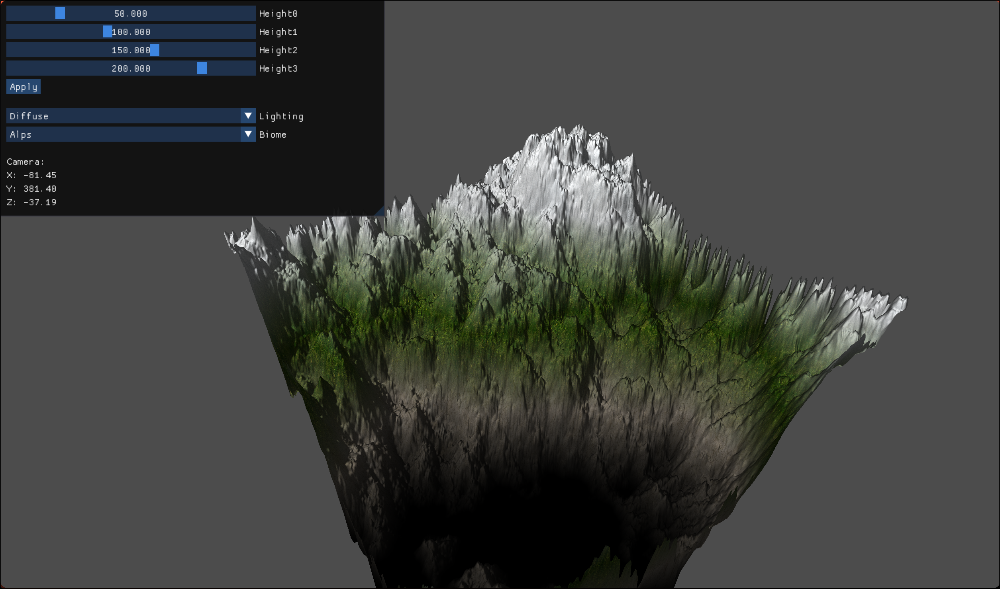
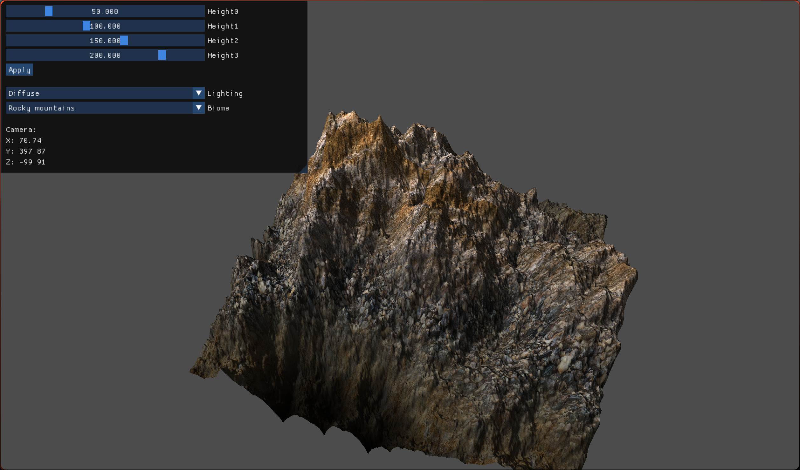
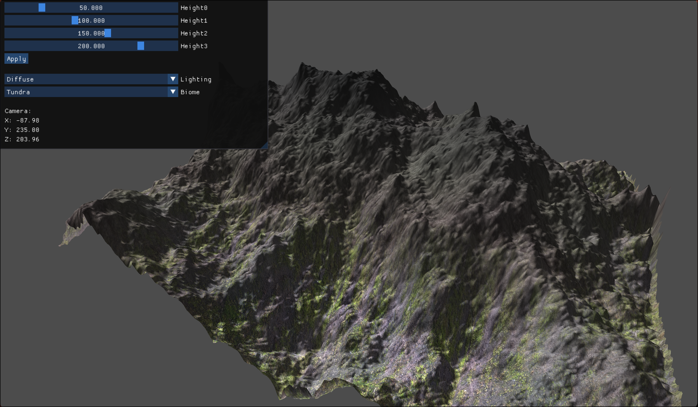
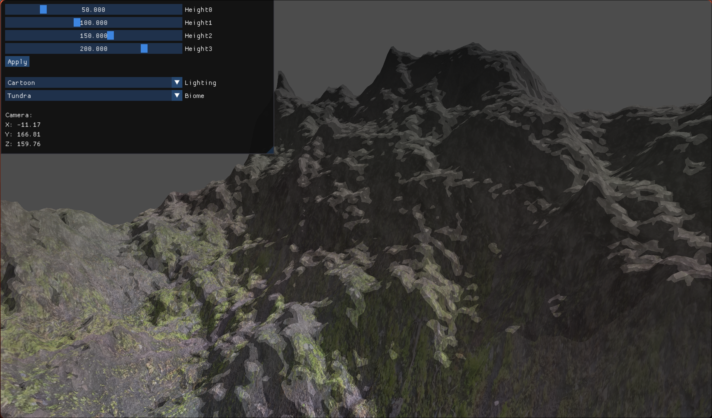

# 3D Procedural Terrain Mesh Generator

3D Procedural Terrain Mesh Generator implemented in C/C++ using OpenGL graphics library incorporating ImGui for interactive user input, and STB texture-to-color buffer.

## Table of Contents
- [Features](#features)
- [Usage](#usage)
- [License](#license)

## Features
- Biome selection:
  - User can choose between 5 different biome types(Alps, Rocky Mountains, Flatlands, Desert, Tundra) using the ImGui interface.
- Lighting selection:
  - User can select a lighting type using the ImGui interface. 
  Available lighting types are: 1. classic - diffuse lighting, 2. cartoon - style lighting
- Texture-height selection:
  - Every texture is mapped to a certain height on the y-axis. User can change the height boundaries for different textures and alter the look of the terrain mesh.
  
## Dependencies - Arch Linux
1. Install GLFW (for window creation and input handling):
   ```bash 
   sudo pacman -S glfw

2. Install OpenGL core libraries:
    ```bash 
   sudo pacman -S mesa
   
## Acknowledgments

- This project uses [ImGui](https://github.com/ocornut/imgui), which is licensed under the MIT License, see LICENSE.

- This project uses [STB](https://github.com/nothings/stb), which is licensed under the MIT License, see LICENSE.

## About

- 'h' and 'src' contain key graphics pipeline abstractions. 
  - The Cherno's OpenGL beginner series (https://www.youtube.com/watch?v=W3gAzLwfIP0&list=PLlrATfBNZ98foTJPJ_Ev03o2oq3-GGOS2) helped me get the grasp of the basic concepts and abstractions, so my implementation is pretty similar or in some cases the same as the implementation from the tutorial series.
  - These classes serve as the basic framework for the rest of the project.
- 'imgui_windows' contains the ImGui window abstraction.
- 'terrain' contains key terrain mesh-related abstractions. 
  - I followed awesome tutorial series from OGLDev(Etay Meiri): https://www.youtube.com/watch?v=4Rbk6xRzs6g&list=PLA0dXqQjCx0S9qG5dWLsheiCJV-_eLUM0, which helped me understand different algorithms and methods described in the book from Trent Polack - Focus on 3D Terrain Programming. I tried to replicate his implementation using my framework, so some of the code implemented is altered to fit my framework API, but algorithm implementation is pretty similar, or even the same as Etay's. Here is a link to the Etay's GitHub repo: https://github.com/emeiri/ogldev.

## Images

(Alps, Diffuse)


(Alps, Cartoon - closeup)


(Rocky mountains, Diffuse)


(Flatlands, Diffuse)


(Desert, Diffuse)


(Tundra, Diffuse)


(Tundra, Cartoon-closeup)


## Controls:
    - Enter fly mode: 'M' -> you can now move your mouse around
        --> up: 'U'
        --> forward: 'W'
        --> left: 'L'
        --> right: 'R'
        --> back: 'D'

    - Enter user-input mode: 'N' 
        --> you can't move your mouse, but you can click on the ImGui window.
    
    - Exit the program: 'Esc'
