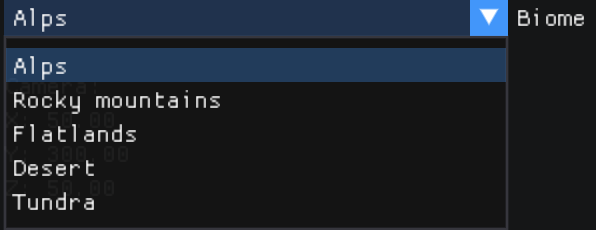

# Terrain Mesh Generator
## Description
* **Terrain Mesh Generator** implemented in C/C++ using ImGui and OpenGL libraries. Currently available on **macOS**, but can be made to work on *Linux* with minor tweaks in code.

---

## Table of Contents

1. [Features](#features)
2. [Installation](#installation)
3. [Usage](#usage)
4. [License](#license)
5. [Sources](#sources)

---

## Features
### Biome selection:

User can choose between 5 different biome types

  


### Texture-height mapping:

Every texture is mapped to a certain height on the y-axis. User can change the height boundaries for different textures and alter the look of the terrain mesh.


---

## Installation

#### Prerequisites:
Before building the project, ensure you have the following installed:

* **CMake** (version 3.10 or later)
* A **C++ Compiler** supporting C++17
* **GLFW**:

On macOS, you can install GLFW using Homebrew:

  ```bash
  brew install glfw
  ```

* **GLEW**:

Install GLEW using Homebrew:
  ```bash
  brew install glew
  ```

* **OpenGL**:

macOS provides OpenGL as part of its system libraries, so no additional installation is needed.

* **ImGui**:

The ImGui library is included in the project under the vendor/ImGui directory, so no extra installation is needed for it.

---

## Usage:


* **Fly mode** allows you to move and look around the scene. Hides and captures your mouse cursor.
* **User-input mode** shows your mouse cursor and allows you to interact with the ImGui window.


(Alps, Diffuse)


(Rocky mountains, Diffuse)


(Flatlands, Diffuse)


(Desert, Diffuse)


(Tundra, Diffuse)


---

## License

- This project uses [ImGui](https://github.com/ocornut/imgui), which is licensed under the MIT License, see LICENSE.

- This project uses [STB](https://github.com/nothings/stb), which is licensed under the MIT License, see LICENSE.

---

## Sources

- [**The Chernos OpenGL beginner series**](https://www.youtube.com/watch?v=W3gAzLwfIP0&list=PLlrATfBNZ98foTJPJ_Ev03o2oq3-GGOS2)
    helped me get the grasp of the basic concepts and abstractions. My implementation is greatly inspired by the tutorial series.


- [**OGLDevs(Etay Meiri) Terrain Generation series**](https://www.youtube.com/watch?v=4Rbk6xRzs6g&list=PLA0dXqQjCx0S9qG5dWLsheiCJV-_eLUM0)

    which helped me understand different algorithms and methods described in the book from **Trent Polack - Focus on 3D Terrain Programming**. I tried to replicate his implementation using my framework. [Link to the Etay's GitHub repo](https://github.com/emeiri/ogldev).
